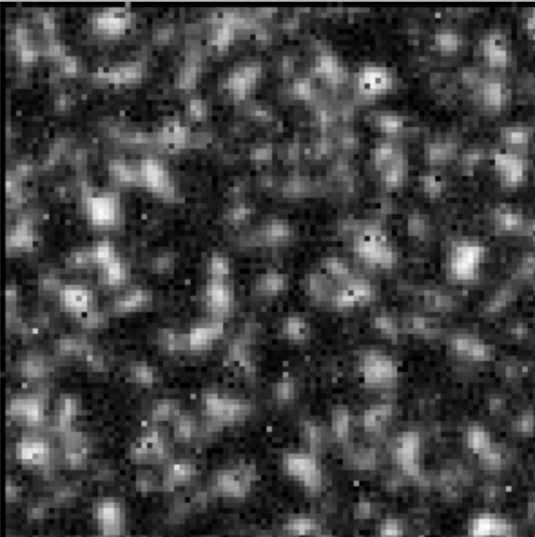

  

This repo has scripts for simulating and running a distributed reputation system.

# Iterated prisoner's dilemma

The image shows a snapshot in time of the output of an iterated prisoner's dilemma (PD) simulation, in which the evolution of cooperation and the impact of reputation are observed.

At each time step, agents interact with their neighbors in a pairwise fashion through an iteration of a 2x2 PD game.

The shade of the color at each site is proportional to the degree of cooperation of the strategy at the site.

In certain conditions, long-lived regions of cooperation appear

It is observed that cooperating strategies are favored in the presence of a reputation system.

# Running the script:
In the pd/ directory. Run as `python main.py`. Adjust config settings in pd.py

We are motivated to create such a reputation system using publicly-available data, so that cooperation can be increased.

# Reputation System Principles:
1. Reputation is a fungible quantity naturally associated with persons.

2. Reputation can be created or destroyed through transactions with others.

3. Reputation is correlated with the likelihood that future transactions partners will decide to increase your reputation.

4. There is a fixed cost to each transaction.

5. Logging a transaction with the reputation system confers a benefit (to encourage participation) and also carries a risk (to discourage fake transactions).

6. If both parties cooperate, their reputation goes up modestly.
7. If both parties defect, their reputation does not change (and they pay the fixed transaction cost).
8. If either party defects, while the other party does not, the defecting party earns a large reward. The cooperating party earns no reward, and pays a penalty.

* Code for a simple reputation system is provided in `pd/reputation`.
